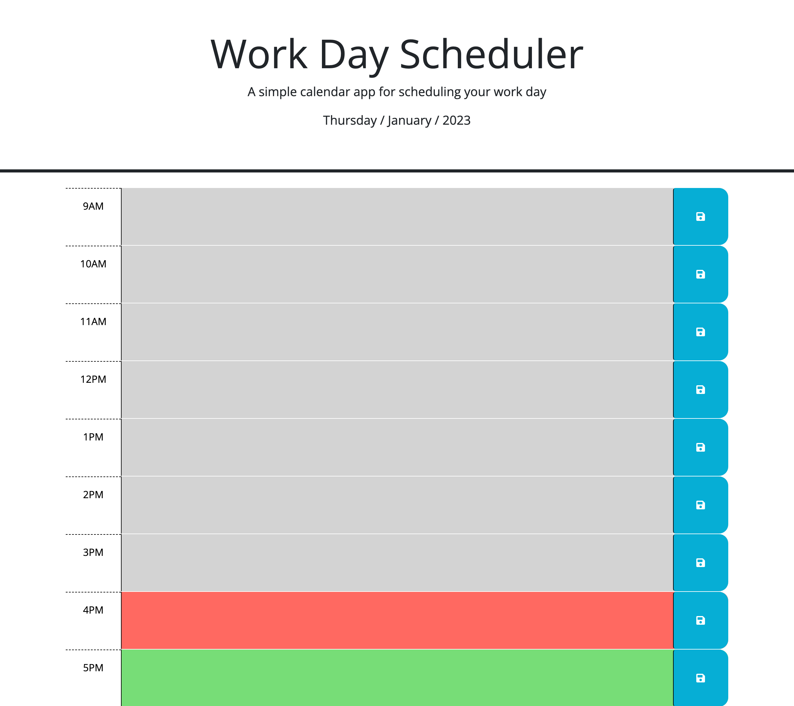

# Plan-Your-Day

Plan your day is a website where you can plan your business day accordingly. You can add in your hourly tasks that you need to accomplish. The time-blocks will have corrisponding colors based on the time, for example the current time will appear red, all the past times will appear grey, and the future times will appear green. Also there is no need to keep the browser running all day. Open it when you need to and the information will still be there.

## Table of Contents

- Where To Find
- How To Use
- Credits
- License
- Screenshot

## Where To Find

Link: [Plan-Your-Day](https://connor812.github.io/Plan-Your-Day/)

## How To Use

You can add in your hourly tasks that you need to accomplish. The time-blocks will have corrisponding colors based on the time, for example the current time will appear red, all the past times will appear grey, and the future times will appear green. Also there is no need to keep the browser running all day. Open it when you need to and the information will still be there.

## Credits

This application was created by Connor. Huge shout out to the University of Toronto for teaching me how to create this page.

## License

GNU GENERAL PUBLIC LICENSE
Version 3, 29 June 2007

## Screenshot

